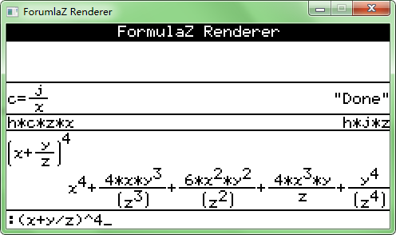

# FormulaZ Renderer #
- - -
###关于###
ForumlaZ WH版是为黑白屏幕的计算器开发的公式排版工具。  
目前此工具仍在开发中，拥有十分多的bug，日后将持续更新、添加新功能。  
目前，公式的排版方式不可自定，书写格式以eigenmath的格式为样例。目前只制作了基本的双目操作符（加减乘、分数线、乘方）的模板。  
此工程为win32版本，使用SDL实现绘图。可移植到其他平台。  
内嵌了eigenmath的core作为测试。
- - -
###截图###

- - -
###开源###
此软件以[MPL2.0](http://www.mozilla.org/MPL/2.0/)协议开源。